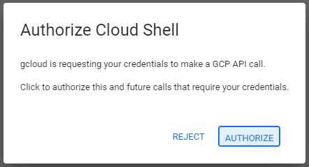

# GCP Onboarding

### 🖥️This repository contains the scripts to run in Google Cloud Shell in order to enable Intelligence for your project.

### ⚠️Important notes

- please make sure that you are logged in to your GCP account
- follow the instructions on the right panel:
1. choose the project id you wish to onboard
2. run the script (copy to the terminal and ENTER)
- During the deployment your project will be set as default and you will be asked to authorize cloud shell.
    
    
    
- In case this is not your fisrt time onboarding the project :
The script will run a clean up before creating all cloudguard resources.
Make sure to consent to the deletion in the terminal window.
- If successful the terminal should output:
  **`Done onboarding.`**

**Good Luck!** 

.png)
