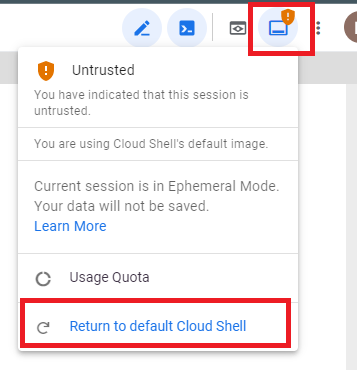

# :cloud: GCP Intelligence Onboarding/Offboarding :cloud:

The scripts here are being used when onboarding to CloudGuard Intelligence through the UI, here is additional info on how to do that:
https://sc1.checkpoint.com/documents/CloudGuard_Dome9/Documentation/Intelligence/Intelligence-Onboard-GCP.htm

### This repository contains Google Cloud Shell scripts allowing you to:
- Onboard your GCP Project to CloudGuard Intelligence
- Offboard your GCP Project from CloudGuard Intelligence

### GCP Account Activity Logs to Intelligence onboarding flow
The script provided will create the following resources:<br><br>
:one: Service account "cloudguard-logs-authentication"<br>
:two: Topic "cloudguard-topic"<br>
:three: Subscription "cloudguard-subscription"<br>
:four: Sink "cloudguard-sink"<br>


### Onboarding Steps

:one: Make sure that you are logged in to your GCP account before starting the Intelligence onboarding wizard in the CloudGuard portal.

:two: At first, you will be asked to trust our repo. Please confirm.<br>
<br>
<b>Note:</b> In case you didn't check the "Trust repo" checkbox, you will encounter error messages.<br> The solution is to : click on "Session information" button in the right side of the screen and "Return to default Cloud Shell" and then exit the window and click again on the "Open in Cloudshell" button.
<br>

:three: Follow the instructions in the Tutorial panel: <br>
- Run the script (copy it, paste it to the terminal and click Enter)<br>
  

- During the deployment, your project will be set as default and you will be asked to authorize Cloud Shell.<br>
  

- <b>Note:</b> If you have previously onboarded this project to Intelligence, the script will run a clean up before handling the new onboarding. Make sure to approve it in the terminal window. <br><br>

:four: After the script finishes running, the terminal should show:
```diff
+ Project Successfully Onboarded
```

**Good Luck!**

