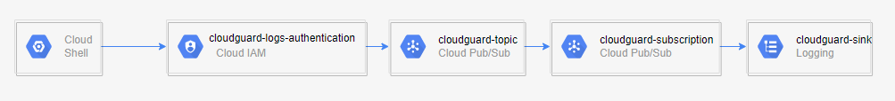

# :cloud: GCP Intelligence Onboarding :cloud:

### This repository contains the scripts to run in Google Cloud Shell in order to enable Intelligence for your project.

Onboarding Activity Logs to Intelligence process:



### ⚠️Important notes

- please make sure that you are logged in to your GCP account
- At first you will be asked to trust our repo. Please make sure to confirm.<br>


Follow the instructions on the right panel: <br>
:one: choose the project id you wish to onboard <br>


:two: run the script (copy to the terminal and ENTER)<br>

    
:three: During the deployment your project will be set as default and you will be asked to authorize cloud shell.<br>

    
:four: :warning: <b>In case this is not your fisrt time onboarding the project : </b>:warning: <br>
The script will run a clean up before creating all cloudguard resources.
Make sure to consent to the deletion in the terminal window. <br><br>
:five: If successful the terminal should output:
```diff
+ Successfully Onboarded.
```

**Good Luck!** 


